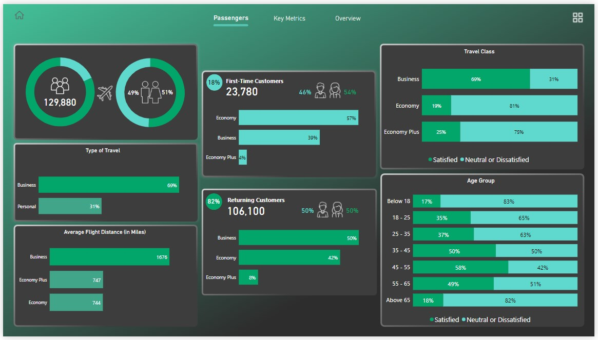
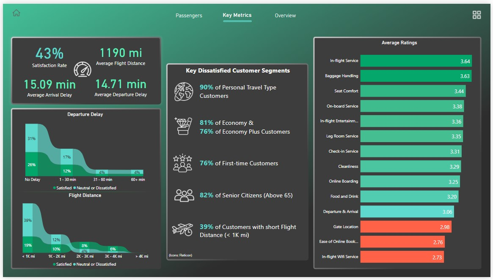
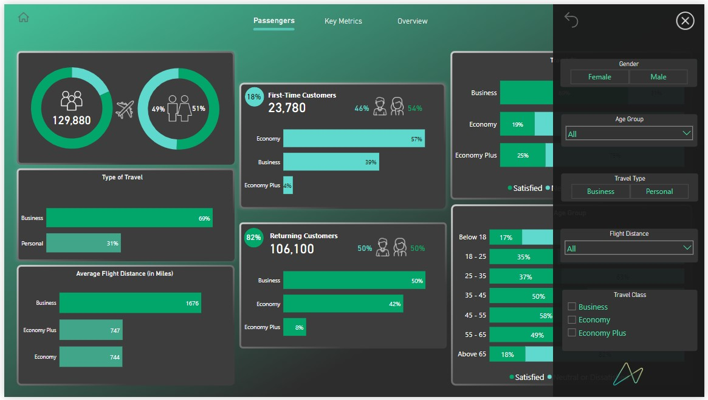
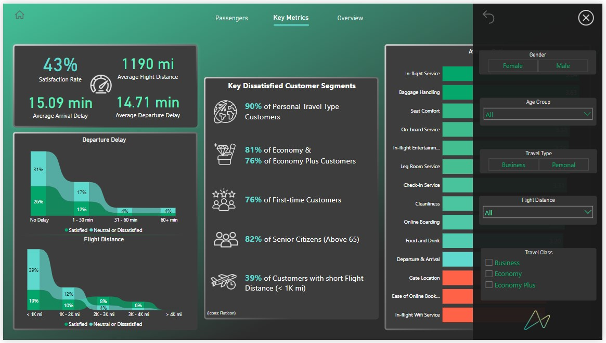
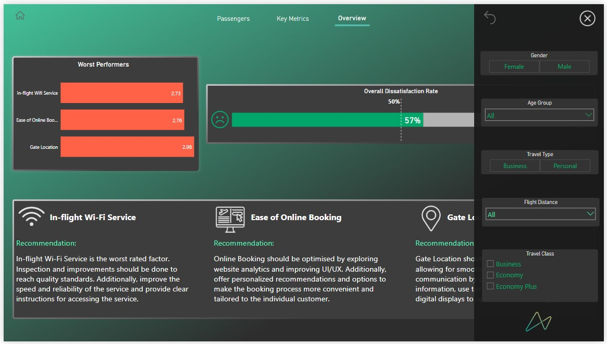

# Airline Passenger Satisfaction Analysis

<small style="font-size: 8px">(Source: [Freepik](https://www.freepik.com/))</small>

## Contents

- [Description](#description)
- [Project Details](#project-details)
- [Key Performance Indicators (KPIs)](#key-performance-indicators-kpis)
  - [Calculated KPIs](#kpis-that-were-calculated)
- [Data Collection](#data-collection)
- [Skills](#skills)
- [Tech Stack](#tech-stack)
- [Insights \& Recommendations](#insights--recommendations)
- [Dashboard](#dashboard)
- [Conclusion](#conclusion)

## Description

Analyzed an Airline Passenger Satisfaction dataset, identifying the key factors that were contributing to a recent dip in customer satisfaction rates by designing a Power BI dashboard report and recommending a data-driven strategy for increasing overall satisfaction rates. The insights gained from this project helped the airline take necessary action to improve their customer satisfaction rates and enhance the overall travel experience for passengers.

#

<small style="font-size: 8px">(Source: [Freepik](https://www.freepik.com/))</small>

## Project Details

The airline industry is highly competitive, and customer satisfaction is a key factor that determines the success of an airline. The airline's leadership team has identified a recent dip in passenger satisfaction ratings which prompted them (the leadership team) to seek recommendations for a data-driven strategy to increase overall satisfaction rates.

The goal of this project was to analyze a dataset of airline passenger satisfaction scores to identify key factors that contributed to the low satisfaction rates and focus on getting back on track. The dataset used for this analysis contains feedback from over 120,100 airline passengers, including additional information about each passenger, their flight, and type of travel, as well as their evaluation of different factors such as cleanliness, comfort, service, and overall experience.

The project involved analyzing the dataset to identify key factors that were contributing to the recent dip in satisfaction rates. This analysis included calculating several key performance indicators such as total passengers, average arrival and departure delays, and satisfaction and dissatisfaction rates.

The analysis revealed several key findings, including a higher percentage of dissatisfied customers, longer average arrival and departure delays, and lower satisfaction rates in certain areas such as cleanliness, legroom, gate location and other services like In-flight Wi-Fi Service and Ease of Online Booking.

Based on these findings, I recommended a data-driven strategy for increasing overall satisfaction rates. This strategy included several key recommendations such as improving In-flight Wi-Fi Service, Ease of Online Booking, and convenient and accessible Gate Locations for smooth boarding by using technology such as mobile apps and digital displays. Additionally, I also recommended improving the cleanliness and legroom comfort of the airline's planes, reducing delays, and providing better customer service.

To present the findings and recommendations to the airline's leadership team, I designed a Power BI dashboard report. The report included visualizations of key performance indicators, and average ratings of the services offered by the airline and provided an overview of the analysis, key findings, and recommended strategy.

The insights gained from this project will help the airline take necessary action to improve their customer satisfaction rates and enhance the overall travel experience for passengers. The airline can use the recommendations to prioritize areas for improvement and make data-driven decisions to stay competitive in the industry.

## Key Performance Indicators (KPIs)

KPIs are measurable values that organizations use to track and evaluate their progress towards achieving specific business objectives. They are used to measure performance over time and allow organizations to make data-driven decisions based on actual results. KPIs are specific to the objectives of an organization or department and can be qualitative or quantitative. They are important metrics that help organizations identify areas for improvement, set targets for future performance, and track their success in meeting their goals.

### KPIs that were calculated:

- **Total Passengers**: The total number of passengers included in the dataset.

- **Percentage Male Passengers**: The percentage of male passengers included in the dataset.

- **Percentage Female Passengers**: The percentage of female passengers included in the dataset.

- **Percentage First-time Customers**: The percentage of passengers who are flying with the airline for the first time.

- **Percentage Returning Customers**: The percentage of passengers who have flown with the airline before.

- **Percentage First-time Male Customers**: The percentage of male passengers who are flying with the airline for the first time.

- **Percentage First-time Female Customers**: The percentage of female passengers who are flying with the airline for the first time.

- **Percentage Returning Male Customers**: The percentage of male passengers who have flown with the airline before.

- **Percentage Returning Female Customers**: The percentage of female passengers who have flown with the airline before.

- **Average Arrival Delay**: The average amount of time that flights are delayed upon arrival, calculated in minutes.

- **Average Departure Delay**: The average amount of time that flights are delayed upon departure, calculated in minutes.

- **Average Flight Distance**: The average distance travelled by flights, calculated in miles.

- **Total Business Travel Customers**: The total number of passengers who are travelling for business purposes.

- **Total Personal Travel Customers**: The total number of passengers who are travelling for personal reasons.

- **Total Satisfied Customers**: The total number of passengers who reported being satisfied with their flight experience.

- **Total Dissatisfied Customers**: The total number of passengers who reported being neutral or dissatisfied with their flight experience.

- **Satisfaction Rate**: The percentage of passengers who reported being satisfied with their flight experience, calculated as the ratio of Total Satisfied Customers to Total Passengers
> Satisfaction Rate = (Total Satisfied Customers / Total Passengers) x 100%

- **Dissatisfaction Rate**: The percentage of passengers who reported being neutral or dissatisfied with their flight experience, calculated as the ratio of Total Dissatisfied Customers to Total Passengers.
> Dissatisfaction Rate = (Total Dissatisfied Customers / Total Passengers) x 100%

#

<small style="font-size: 8px">(Source: [Freepik](https://www.freepik.com/))</small>

## Data Collection

The dataset was taken from the [Data Playground](https://www.mavenanalytics.io/data-playground) of **Maven Analytics** as a CSV file and it contains Airline Satisfaction Scores for 129,880 passengers spread across 24 fields. Each record represents one passenger and each record contains details about passenger demographics, flight distance and delays, travel class and purpose, and ratings for factors like cleanliness, comfort, and service, as well as overall satisfaction with the airline. \
**Link:** [Dataset](Dataset/)

## Skills

- Data Cleaning 
- Data Inspection 
- Data Transformation 
- Data Standardization
- Data Modelling
- Data Visualization
 
> **Data Inspection:** Visually inspecting the data to identify errors, inconsistencies, or missing values.

> **Data Transformation:** Data transformation refers to the process of converting data from one format or structure to another. This can involve various operations such as filtering, sorting, aggregating, joining, and splitting data. Data transformation is often a critical step in data integration, as it enables different sources of data to be combined and processed in a unified way.

> **Data Standardization:** Converting data into a standard format, such as converting all text to lowercase or standardizing date formats.

> **Data Modelling:** Data modelling is the process of creating a conceptual representation of data and its relationships. It involves defining data entities, attributes, and the relationships between them to create a logical structure that can be used to organize, store, and retrieve data efficiently.

## Tech Stack

- Microsoft Excel 
- Power Query 
- DAX 
- Microsoft Power BI

#

<small style="font-size: 8px">(Source: [Freepik](https://www.freepik.com/))</small>

## Insights & Recommendations

1. In-flight Wi-Fi Service is the worst-rated factor with an average rating of **2.73**. Inspection and improvements should be done to reach quality standards. Additionally, improve the speed and reliability of the service and provide clear instructions for accessing the service.

2. Online Booking should be optimized by exploring website analytics and improving UI/UX. Additionally, offer personalized recommendations and options to make the booking process more convenient and tailored to the individual customer.

3. Gate Location should be convenient and accessible allowing for smooth boarding. Additionally, improve communication by providing clear and timely gate information, and use technology such as mobile apps and digital displays to optimize the boarding process.

4. Improve the cleanliness of flights by increasing the frequency of cleaning to ensure aircraft are thoroughly cleaned between flights. Also, train cleaning staff on the proper use of cleaning products, safety protocols, and best practices to improve overall customer satisfaction.

5. **90%** of personal travel customers are dissatisfied, and the airline should focus on improving the in-flight experience. Providing more entertainment options, comfortable seating, and healthy food choices can improve satisfaction levels. Additionally, offering flexible ticketing options, such as free cancellations or changes, can help alleviate the stress of travel planning and make the overall experience more pleasant.

6. **81%** of the economy and 76% of the economy plus customers are dissatisfied, so the airline should focus on improving the in-flight experience for these customers. Providing more legroom, better-quality seats, and offering complimentary snacks and beverages can improve customer satisfaction levels. Airlines can also consider offering premium amenities, such as priority boarding or in-flight Wi-Fi, for an additional fee to customers willing to pay for an enhanced experience.

7. **76%** of first-time customers are dissatisfied, airlines should focus on providing a positive first-time experience to ensure customer retention. Additionally, providing customers with personalized recommendations based on their travel preferences can help build customer loyalty.

8. Customers in the age group of 18 to 25 and 25 to 35 are highly dissatisfied. The airline should conduct market research to understand the needs and preferences of younger customers and tailor their services to meet their expectations. This may involve offering more affordable fares, providing more entertainment options on board, and improving the overall customer experience.

9. **82%** of senior citizens are dissatisfied, so the airline should consider providing extra assistance to older passengers. Additionally, airlines can consider offering discounted fares to senior citizens to show their appreciation for this valuable customer segment.

10. **39%** of customers with short flight distance (< 1K mi) are dissatisfied, so the airline should focus on improving the in-flight experience for short-haul flights. Providing comfortable seating and entertainment options can make the flight more enjoyable. Additionally, airlines can consider offering flexible ticketing options for short-haul flights to make it easier for customers to book and modify their travel plans.

## Dashboard

[Link to the Dashboard](https://app.powerbi.com/view?r=eyJrIjoiMGRjOTFhOWMtOWFiYS00NWQ0LWJlNmUtNGZjMTUzZGQ1ZDY1IiwidCI6ImFhODMxNTE3LTU2ZTQtNGM4MS1iNTViLTYxZTk1MjQwMGE1MCJ9)

## Conclusion

In conclusion, based on the analysis of the airline passenger satisfaction data, it is clear that there are several key areas that need to be addressed to increase the overall satisfaction rate. These areas include improving cleanliness, reducing departure and arrival delay time, offering more personalized service, enhancing comfort, and focusing on the needs of key dissatisfied customer segments such as personal travel type customers, economy class passengers, first-time customers, senior citizens, and customers with short flight distances. By implementing the recommended data-driven strategies, the airline can improve its satisfaction rate and enhance the overall customer experience. The Power BI dashboard report provides a comprehensive overview of the KPIs and insights gathered from the analysis, allowing the airline leadership team to make informed decisions and take necessary actions to improve passenger satisfaction.

---